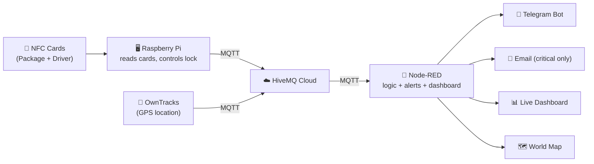
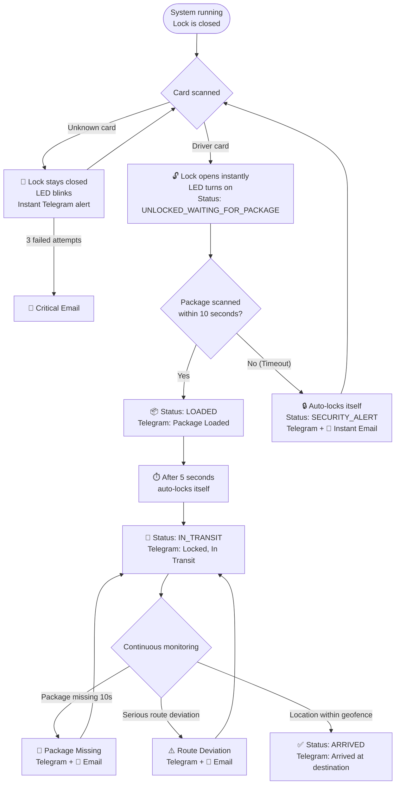

# 📦 Smart Secure Delivery Tracking System

A smart delivery security and tracking system built on Raspberry Pi + Node-RED + MQTT. It verifies the driver's identity via NFC, controls the lock and alarm locally on the device itself, tracks the shipment's location in real time, and sends alerts via Telegram and Email whenever a security event occurs.

## 🧩 Components

| Component | Role |
|---|---|
| **NFC Cards** (PN532) | Package identity and driver identity |
| **Raspberry Pi** | Reads the cards, decides locally whether access is authorized, controls the lock and LED |
| **MQTT (HiveMQ Cloud)** | Secure communication channel between the Pi and Node-RED |
| **Node-RED** | Receives events, manages state, sends alerts, renders the dashboard |
| **OwnTracks** | Mobile app that streams live GPS location |
| **Telegram Bot** | Instant alerts + `/status` and `/location` commands |
| **Email (Gmail)** | Alerts reserved for critical events only |
| **Worldmap** | Live map: shipment location, route trail, and destination marker |

## 🏗️ Architecture



## 🔄 Full Scenario (Flow)



## 🔐 Security Principle: Fail-Safe Design

The decision of **"who is allowed to open the lock"** is made **locally by the Raspberry Pi itself** (not by Node-RED). This means that even if the internet or Node-RED goes down, the lock and alarm will keep working correctly, because the actual security logic doesn't depend on the network. The network (MQTT/Node-RED) is only responsible for **alerts and visualization**, not for the unlock decision itself.

## 📁 Repository Contents

```
smart-secure-delivery-tracking/
├── raspberry-pi/
│   └── delivery_tracker.py      # Full Raspberry Pi code
├── node-red/
│   └── delivery_flow.json       # Ready-to-import flow
├── docs/
│   └── Smart_Secure_Delivery_Presentation.pptx
└── README.md
```

## ⚙️ Setup

### 1) Raspberry Pi
```bash
pip3 install paho-mqtt==1.6.1 adafruit-circuitpython-pn532 RPi.GPIO gpiozero --break-system-packages
python3 raspberry-pi/delivery_tracker.py
```
Edit the top of the file for your project: `PACKAGE_UID`, `DRIVER_UID`, `DRIVER_NAME`, and your MQTT broker credentials.

### 2) Node-RED

> ⚠️ **This file intentionally contains no sensitive data** (passwords, tokens, real IDs) — every such field is left as `PUT_YOUR_..._HERE` so the repository stays safe to publish. Fill in your own credentials after importing, from inside Node-RED (not by editing the file).

1. **Menu (☰) → Import** → select `node-red/delivery_flow.json`
2. Open the **MQTT broker** node and enter: server address, username, and password
3. Open the **Telegram bot** node and enter: your Token and your Chat ID (in the chatids field)
4. Open the **Email** node and enter: your email + App Password
5. Open the **"OwnTracks Location"** node and update the topic to match your OwnTracks settings (`owntracks/<username>/<device_id>`)
6. Check the functions containing `PUT_YOUR_TELEGRAM_CHAT_ID_HERE` (there's more than one) and replace them with your real Chat ID
7. **Deploy**
8. On first setup, open OwnTracks and send your location once, then press **"📍 Set Destination Here"** to calibrate the arrival point to your current location

### 3) Dashboard
`http://<node-red-ip>:1880/ui`

## 📡 MQTT Topics

| Topic | Direction | Content |
|---|---|---|
| `delivery/PACKAGE_102/status` | Pi → Node-RED | Full shipment status (JSON) |
| `delivery/PACKAGE_102/event` | Pi → Node-RED | Security/operational events (JSON) |
| `delivery/PACKAGE_102/ir` | Pi → Node-RED | Package presence (PRESENT/ABSENT) |
| `delivery/PACKAGE_102/command` | Node-RED → Pi | Optional manual override (UNLOCK/LOCK) |
| `owntracks/<user>/<device>` | Mobile → Node-RED | Shipment GPS location |

## 🗺️ State Machine

```
REGISTERED → UNLOCKED_WAITING_FOR_PACKAGE → LOADED → IN_TRANSIT → ARRIVED
                     │                                    │
                     └──────────────┬─────────────────────┘
                                     ▼
                             SECURITY_ALERT
```
