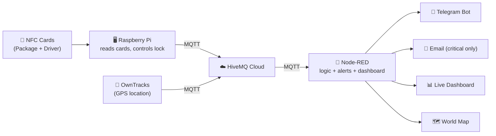
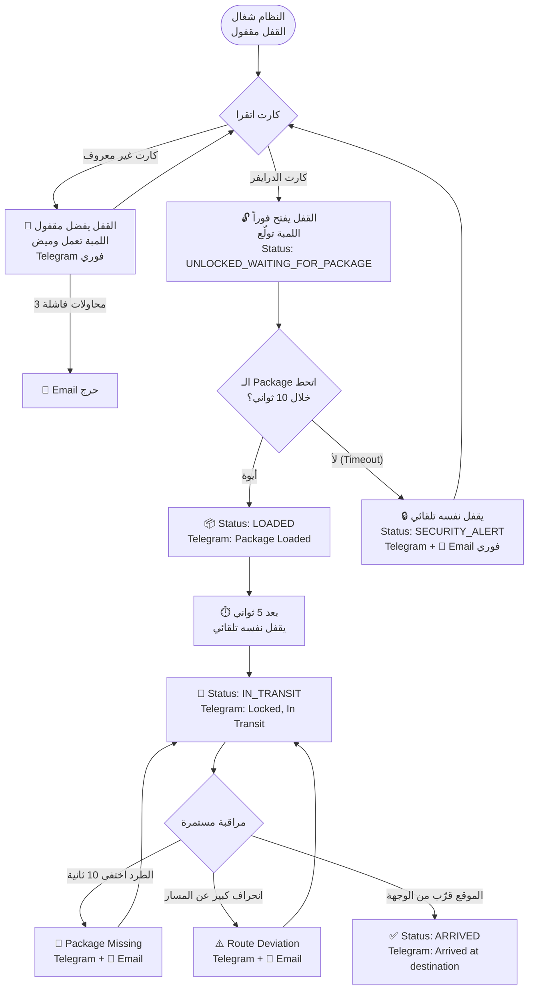

# 📦 Smart Secure Delivery Tracking System

نظام تتبع وتأمين شحنات ذكي مبني على Raspberry Pi + Node-RED + MQTT، بيتحقق من هوية السائق عن طريق NFC، بيتحكم في القفل والإنذار فورياً على مستوى الجهاز نفسه، بيتابع موقع الشحنة لحظة بلحظة، وبيبعت تنبيهات على Telegram و Email عند أي حدث أمني.

## 🧩 المكونات

| المكون | دوره |
|---|---|
| **NFC Cards** (PN532) | هوية الطرد وهوية السائق |
| **Raspberry Pi** | يقرأ الكروت، يقرر محلياً هل الوصول مصرح له، يتحكم في القفل واللمبة |
| **MQTT (HiveMQ Cloud)** | قناة الاتصال الآمنة بين الراسبراي و Node-RED |
| **Node-RED** | يستقبل الأحداث، يدير الحالة، يرسل التنبيهات، يعرض الداشبورد |
| **OwnTracks** | تطبيق موبايل بيبعت موقع GPS لحظة بلحظة |
| **Telegram Bot** | تنبيهات فورية + أوامر `/status` و `/location` |
| **Email (Gmail)** | تنبيهات للحالات الحرجة بس |
| **Worldmap** | خريطة حية: موقع الشحنة، مسارها، ونقطة الوجهة |

## 🏗️ Architecture



## 🔄 السيناريو الكامل (Flow)



## 🔐 مبدأ الأمان: Fail-Safe Design

قرار **"مين مسموح له يفتح"** بياخده **الراسبراي نفسه محلياً** (مش Node-RED). يعني حتى لو الإنترنت أو Node-RED وقعوا، القفل والإنذار هيفضلوا شغالين صح، لأن الأمان الفعلي مش معتمد على الشبكة. الشبكة (MQTT/Node-RED) مسؤولة بس عن **التنبيهات والعرض**، مش عن قرار الفتح نفسه.

## 📁 محتويات الريبو

```
smart-secure-delivery-tracking/
├── raspberry-pi/
│   └── delivery_tracker.py      # كود الراسبراي الكامل
├── node-red/
│   └── delivery_flow.json       # Flow جاهز للـ Import
├── docs/
│   └── Smart_Secure_Delivery_Presentation.pptx
└── README.md
```

## ⚙️ التشغيل

### 1) الراسبراي
```bash
pip3 install paho-mqtt==1.6.1 adafruit-circuitpython-pn532 RPi.GPIO gpiozero --break-system-packages
python3 raspberry-pi/delivery_tracker.py
```
عدّلي أول الملف حسب مشروعك: `PACKAGE_UID`, `DRIVER_UID`, `DRIVER_NAME`, وبيانات الـ MQTT Broker.

### 2) Node-RED

> ⚠️ **الملف ده متعمد إنه ميحتويش على أي بيانات حساسة** (باسوردات، توكنز، أرقام حقيقية) — كل الحقول دي متسيبة بـ `PUT_YOUR_..._HERE` عشان الريبو يبقى آمن للنشر. لازم تحطي بياناتك بنفسك بعد الـ Import، من جوه Node-RED (مش من الملف نفسه).

1. **Menu (☰) → Import** → اختاري `node-red/delivery_flow.json`
2. افتحي node الـ **MQTT broker** وحطي: عنوان السيرفر، اليوزرنيم، والباسورد بتاعتك
3. افتحي node الـ **Telegram bot** وحطي: الـ Token بتاعك، والـ Chat ID بتاعك (في خانة chatids)
4. افتحي node الـ **Email** وحطي: إيميلك + App Password
5. افتحي node **"OwnTracks Location"** وعدّلي الـ Topic ليبقى مطابق لإعدادات OwnTracks بتاعتك (`owntracks/<username>/<device_id>`)
6. راجعي الـ functions اللي فيها `PUT_YOUR_TELEGRAM_CHAT_ID_HERE` (فيه أكتر من واحدة) واستبدليها بالـ Chat ID الحقيقي بتاعك
7. **Deploy**
8. لو أول مرة، افتحي OwnTracks وابعتي موقعك مرة، وبعدين دوسي زرار **"📍 Set Destination Here"** عشان تظبطي نقطة الوصول على مكانك الحالي

### 3) الداشبورد
`http://<node-red-ip>:1880/ui`

## 📡 MQTT Topics

| Topic | الاتجاه | المحتوى |
|---|---|---|
| `delivery/PACKAGE_102/status` | Pi → Node-RED | حالة الشحنة الكاملة (JSON) |
| `delivery/PACKAGE_102/event` | Pi → Node-RED | أحداث أمنية/تشغيلية (JSON) |
| `delivery/PACKAGE_102/ir` | Pi → Node-RED | وجود الطرد (PRESENT/ABSENT) |
| `delivery/PACKAGE_102/command` | Node-RED → Pi | تحكم يدوي اختياري (UNLOCK/LOCK) |
| `owntracks/<user>/<device>` | Mobile → Node-RED | موقع GPS للشحنة |

## 🗺️ State Machine

```
REGISTERED → UNLOCKED_WAITING_FOR_PACKAGE → LOADED → IN_TRANSIT → ARRIVED
                     │                                    │
                     └──────────────┬─────────────────────┘
                                     ▼
                             SECURITY_ALERT
```
